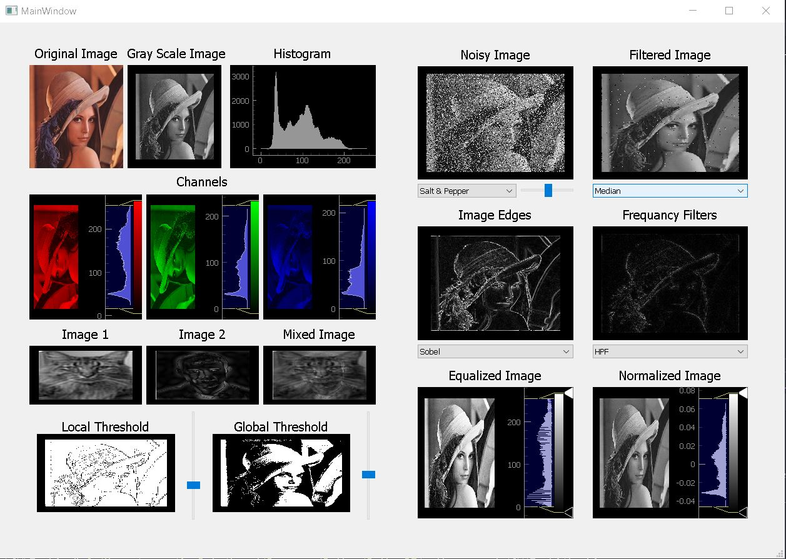
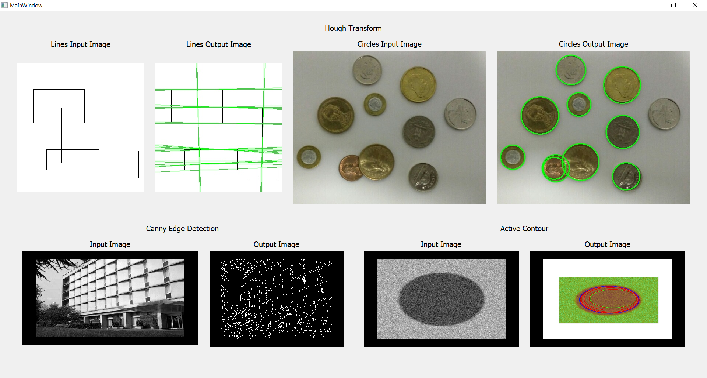
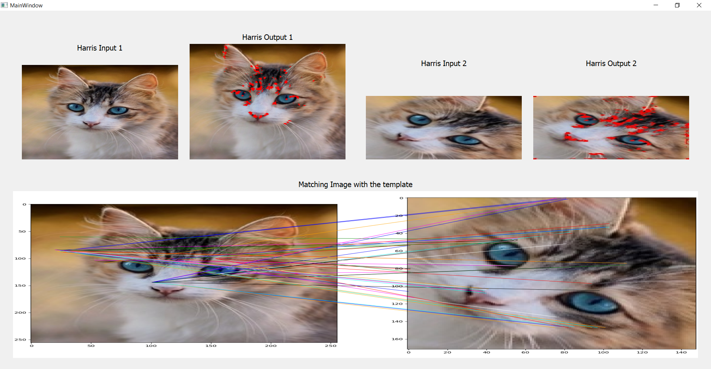
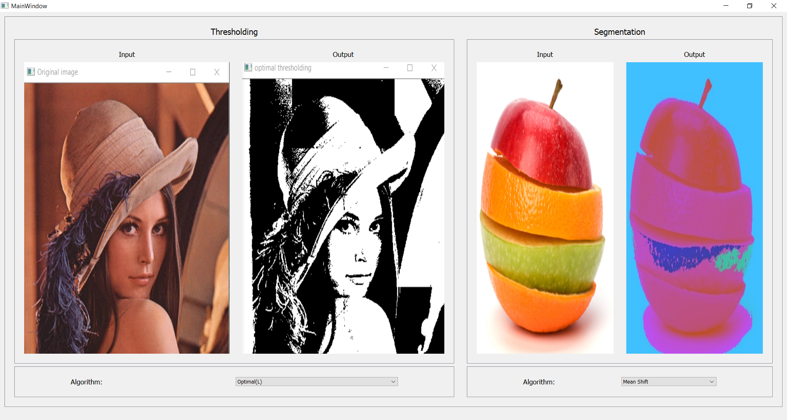
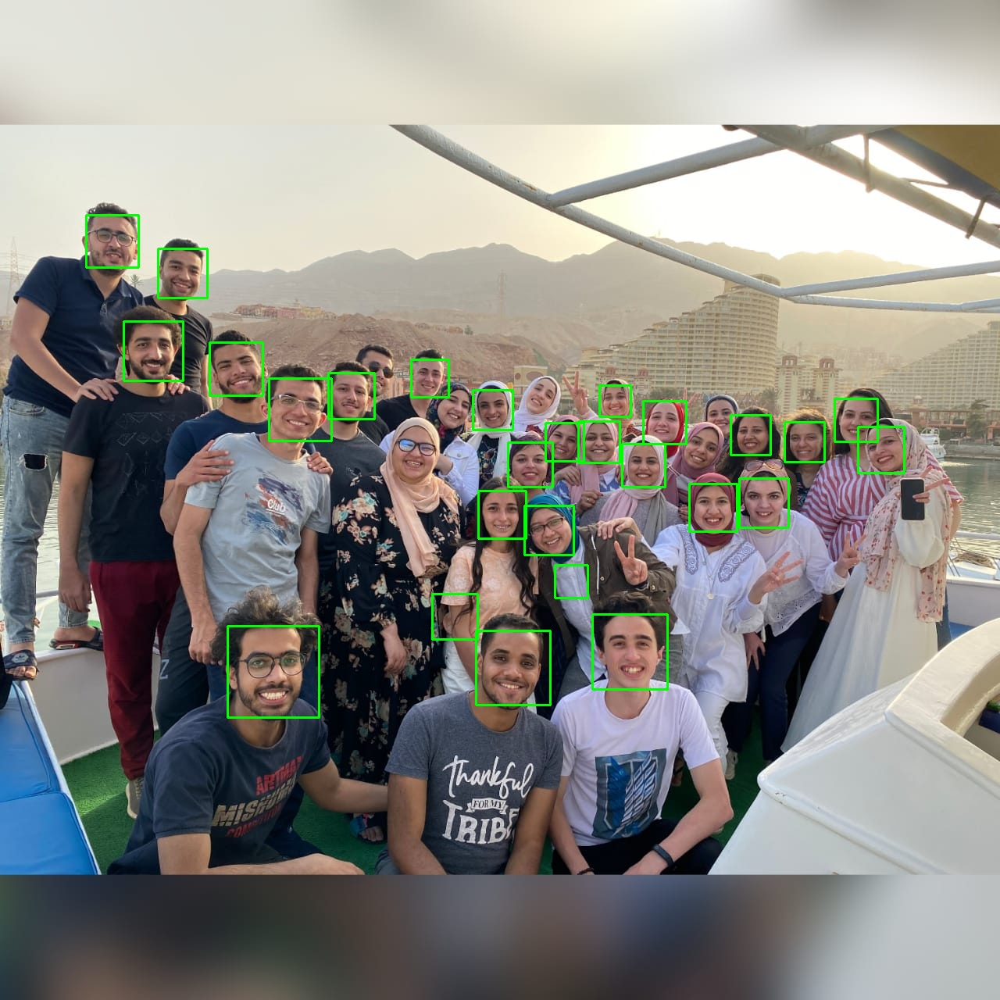

# Computer Vision Course - SBME

### During our Computer Vision course (SBE404) we were able to learn the concepts and apply them on real data to be practically able to use them forward.
### Here are the main results of the several projects we implemented.
~~~
For Further details on a certain topic, check out the ReadMe file of each task by clicking on it's hyperlink.
~~~

| Requiered Part | Title |
| ----------- | ----------- |
| [Project 1](https://github.com/Almotasem100/Computer-Vision/tree/main/Task1) | Editing and applying filters on an image |
| [Project 2](https://github.com/Almotasem100/Computer-Vision/tree/main/Task2) | Edge detections |
| [Project 3](https://github.com/Almotasem100/Computer-Vision/tree/main/Task3) | Haris and SIFT operators |
| [Project 4](https://github.com/Almotasem100/Computer-Vision/tree/main/Task4) | Thresholding |
| [Project 5](https://github.com/Almotasem100/Computer-Vision/tree/main/Task5) | Faces Recognition|
---

# Team Members

| Name | GitHub_UserName |
| ----------- | ----------- |
| Ahmed Adel | AhmedAdel21 |
| Remon Albear | remonalbear |
| Abdulla Zahran | Abdolla25 |
| Mohammed Almotasem | Almotasem100 |

---

# Project 1

## Applying Filters

---

---

# Project 2

## Edge Detection

---

---

# Project 3

## Haris & SIFT

---

---

# Project 4

## Thresholding images using different algorithms

---

---

# Project 5

## Face recognition in an image

---

---

